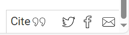

# Cite This: Academic outputs on Github Pages? Here's how to make them citable

Notes and files by Geoff Ford [geoffrey.ford@canterbury.ac.nz](mailto:geoffrey.ford@canterbury.ac.nz).

Academic research isn't just published in journals. If you are blogging, releasing software, data-sets and other kinds of digital outputs via a Github pages site (or using Jekyll via another host) here's a way to make this work easy to cite, with text-based recommended citations and auto-importing to citation managers (e.g. EndNote etc).

This is a reasonably simple and manual approach that doesn't rely on a specific Jekyll plugin and/or Github Actions. I'm leaving some notes on how I've done this here in case it is useful for others. 

## How it works ...

I'm using this on sites for research projects I'm involved with. Here's a couple of example pages:

* [The Rise of the Robot Quadrupeds](https://mappinglaws.net/rise-robot-quadrupeds.html)
* [The Geopolitics of Critical Minerals: How the Race for Critical Minerals is Shaping the Discourse of Deep-Sea Mining in the Pacific](https://miningthesea.net/geopolitics-of-deep-sea-mining)

You will also notice there are links in the bottom right of the page to share or cite the page.

Clicking the "Cite" link takes you to the bottom of the page and a sample citation and links to export the citation using common formats (i.e. RIS, BibTeX, EndNote).


## Steps to set this up ...

1. To your _config.yml file add a new variable with the name of your research project, organisation or website - this is who will be shown as the publisher:
    
    ```yaml
    cite_source:	       "The name of your research project, organisation or website (used for the publisher)"

2. To the footer of your site (normally in a file called _includes/footer.html) add the following code:

    ```html
    <div id="share-links">
    
    <a href="#cite-this" title="Cite or import into your reference manager" id="cite-link">Cite</a>
    
    <a target="_blank" class="icon-only" title="Share on Twitter" href="https://twitter.com/intent/tweet?url={{ site.url }}{{ page.url }}" id="tweet-link"><span>Share on Twitter</span></a>
    <a target="_blank" class="icon-only" title="Share on Facebook" href="https://www.facebook.com/sharer/sharer.php?u={{ site.url }}{{ page.url }}" id="fb-link"><span>Share on Facebook</span></a>
    <a href="mailto:?subject=&body={{ site.url }}{{ page.url }}" class="icon-only" title="Share by email" id="email-link"><span>Share by email</span></a>
    </div>
    ``` 

3. In this repository there is a file assets/css/cite-styles.css. Add the styles from that file to your stylesheet (often in places like assets/css/site.css). You could also just include copy that file into your css directory and include it in your site's head.

4. Copy the file _includes/cite.html from this repository to your _includes directory. 

5. You will probably have a file called _layouts/post.html (whatever the name of the layout you are using for posts is). Add the following code to your layout file after the content of the post:

    ```html
    
    
    
    ```

    It should look something like this ...
    
    ```html
        <article>
        {{ content }}
        </article>
        
        
        
    ```

6. Copy the layouts used to generate the citation export formats (cite-bib.html, cite-enw.html, cite-ris.html) from this repository's _layout directory to your _layout directory.

7. Create a directory called `cite`. This is where the citation export files will be stored.

## Make a post citable ...

Making a post citable involves two steps:

1. You need to add some meta-data to the header of the post markdown file. You can see an example in the _posts directory of this repository. Here's a snippet of what you need to add:

```yaml
has_citation: true
permalink: /example-post
author_cite: ["Scholar, Jane", "Academic, Jack", "Researcher, Jill"]
author_cite_abbreviated: ["Scholar, J.", "Academic, J.", "Researcher, J."]
cite_identifier: "scholar_example_post_2024"
```

I'll break it down and explain it a little:

* `has_citation: true` - This enables the citation text and ilnks below the post.
* `permalink: /example-post` - This is the URL of the post. You might already have this in the header of your markdown file. This is required to make the citation export functionality work.
* `author_cite: ["Scholar, Jane", "Academic, Jack", "Researcher, Jill"]` - This is a array of the authors of the post. This is used to generate the exportable citation data.
* `author_cite_abbreviated: ["Scholar, J.", "Academic, J.", "Researcher, J."]` - This is an array of the abbreviated authors of the post. This is used to generate the recommended text citation (assuming something like APA).
* `cite_identifier: "scholar_example_post_2024"` - The BibTeX format needs a unique indentifier like this. It shouldn't have spaces. I recommend something like author last name + year, or if you are going to have lots of things, include unique text from the title.

2. The last step is to add a .bib, .ris, and .enw file to the cite directory. These are essentially empty placeholder files that tells Jekyll to generate the citation export links. The files you create should have the same file names as the permalink you assigned above. So if your permalink is /example-post, you should have a file called cite/example-post.bib, cite/example-post.ris, and cite/example-post.enw. There is nothing in these files except the relevant layout to use when generating the file. The data for these files are retrieved from the original post. 

So for the .bib file the contents of the file will be:

```yaml 
---
layout: cite-ris
---
```

For the .ris file the contents of the file will be:

```yaml 
---
layout: cite-ris
---
```

For the .enw file the contents of the file will be:

```yaml 
---
layout: cite-enw
---
```

You can see examples based on the /example-post in the cite directory of this repository. You could just copy these into your cite directory and rename them to match the permalink of your post. You don't need to bother with the contents of the files then.

Note: One really helpful feature of Github Pages is that it will automatically set the right mime type for these files and when you click the link a download will be initiated. This typically means you can open it in your citation manager.

## That's it!

If you use this let me know!
